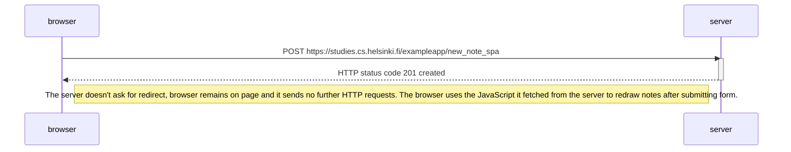

```mermaid
sequenceDiagram
    participant browser
    participant server

    browser->>server: POST https://studies.cs.helsinki.fi/exampleapp/new_note_spa
    activate server
    server-->>browser: HTTP status code 201 created
    deactivate server

    Note right of browser: The server doesn't ask for redirect, browser remains on page and it sends no further HTTP requests. The browser uses the JavaScript it fetched from the server to redraw notes after submitting form.
```
